# Contaminación del Aire en Italia

## Caso: Contaminante PM$_{10}$

  

**UNIVERSIDAD NACIONAL DE INGENIERÍA**  
**FIEECS - DCIES**  
**Doctorado en Ciencias e Ingeniería Estadística**

**De los Datos de Monitoreo al Modelo Geoespacial**

| Campo | Información |
|---|---|
| **Grupo** | Antonio Lam García y Miriam Maldonado Avalos |
| **Condición** | Doctorando en Ciencias e Ingeniería Estadística |
| **Curso** | Estadística Espacial — DES332 |
| **Profesor** | Dr. Erick Chacón Montalván |
| **Fuente de datos** | EEA Air Quality Download Service |
| **Contaminante** | PM$_{10}$ |
| **Periodo analizado** | 2013–2024, sin observaciones en 2014 |
| **Año de evaluación** | 2024 |
| **Fecha** | 1 de agosto de 2026 |

**Lima — Perú**

  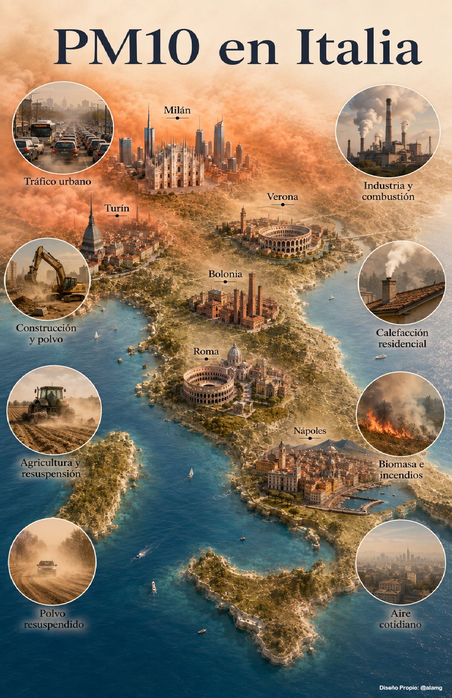

---

## Cómo leer este informe

> **Ruta de lectura**
>
> El informe empieza con una pregunta sencilla: **¿qué es el PM$_{10}$ y por qué puede ser dañino?** Después se explica de dónde salen los datos y cómo funcionan las estaciones de monitoreo. Solo entonces se introduce el modelo geoespacial: primero con una explicación intuitiva y luego con la formulación estadística completa. Finalmente se presentan los indicadores de desempeño, los mapas de Italia, los resultados por regiones y ciudades, y los dos dashboards.

> **Diferencia entre concentración, exposición y efecto sanitario**
>
> La concentración es la cantidad de PM$_{10}$ medida en el aire. La exposición depende además del lugar donde vive o trabaja una persona, el tiempo que permanece allí, la ventilación y su movilidad. El efecto sanitario también depende de edad, enfermedades previas y otras condiciones. Por ello, los mapas de este estudio muestran **presión ambiental potencial**; no diagnostican enfermedades ni calculan muertes atribuibles.

> **Datos centrales del estudio**
>
> Se procesaron 569 archivos Parquet con 8,973,629 registros. Se identificaron 567 estaciones y 554 cumplieron el criterio de cobertura para 2024. El mejor modelo obtuvo RMSE de 2.718 $\mu\mathrm{g}\,\mathrm{m}^{-3}$, MAE de 1.884 $\mu\mathrm{g}\,\mathrm{m}^{-3}$ y $R^2$ espacial de 0.696.

## ¿Qué es el PM$_{10}$ y por qué importa?

### Explicación General del PM$_{10}$

PM significa *particulate matter*, o materia particulada. No es un gas: es una mezcla de pequeñas partículas sólidas y gotas líquidas que permanecen suspendidas en el aire. La expresión PM$_{10}$ agrupa las partículas cuyo diámetro aerodinámico es igual o menor que 10 micrómetros. Su composición puede incluir polvo mineral, sales, hollín, metales, sulfatos, nitratos y material orgánico (World Health Organization, 2024; Clarity Movement, 2026).

> **¿Qué significa “10 micrómetros”?**
>
> Un micrómetro es una millonésima de metro. El número 10 no indica la cantidad de contaminación, sino el tamaño máximo de las partículas incluidas en esta categoría. La concentración se expresa en microgramos de partículas por metro cúbico de aire, es decir, $\mu\mathrm{g}\,\mathrm{m}^{-3}$.

  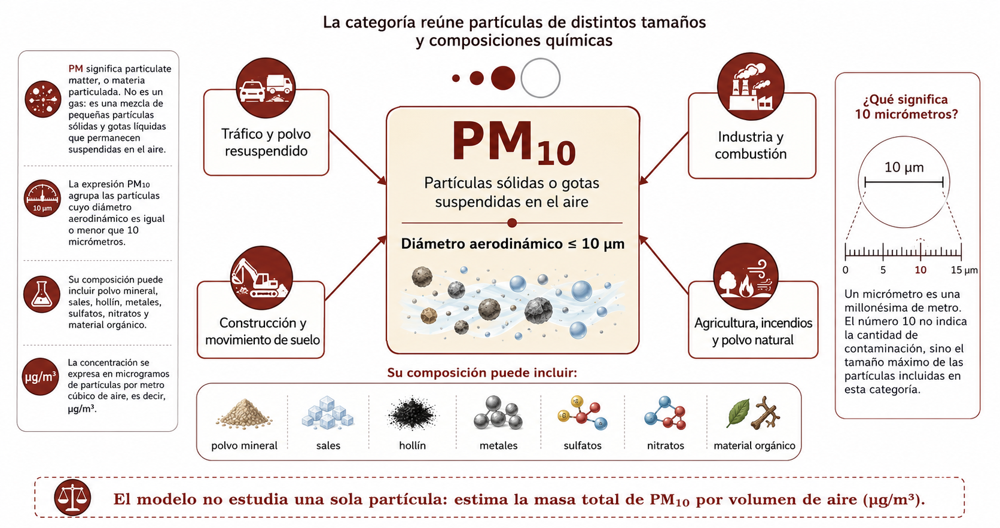

*Figura. Definición sencilla del PM$_{10}$ y principales familias de fuentes.*

### ¿De dónde proviene?

En una ciudad, el PM$_{10}$ puede proceder del desgaste de frenos y neumáticos, del polvo que vuelve a levantarse por el paso de vehículos, de obras de construcción, de actividades industriales y de combustión. En zonas rurales también puede relacionarse con agricultura, movimiento de suelo y polvo natural. Incendios y transporte de polvo a larga distancia pueden elevar las concentraciones incluso lejos de la fuente original (Clarity Movement, 2026; World Health Organization, 2024).

> **Una idea importante**
>
> Una concentración alta no identifica automáticamente una única fuente. El mapa muestra *dónde* hay mayor PM$_{10}$; para responder *por qué* es alto se necesitan variables adicionales, como viento, lluvia, tráfico, industria, uso de suelo y topografía.

### ¿Cómo entra al organismo?

El PM$_{10}$ es inhalable. Una parte se deposita en nariz y garganta y otra puede alcanzar tráquea y bronquios. Dentro de PM$_{10}$ existe una fracción más pequeña que puede penetrar más profundamente en los pulmones. La respuesta del organismo no depende solo de la presencia física de la partícula: también influyen su composición química y los procesos de inflamación y estrés oxidativo asociados a la exposición (World Health Organization, 2024; World Health Organization, 2025).

  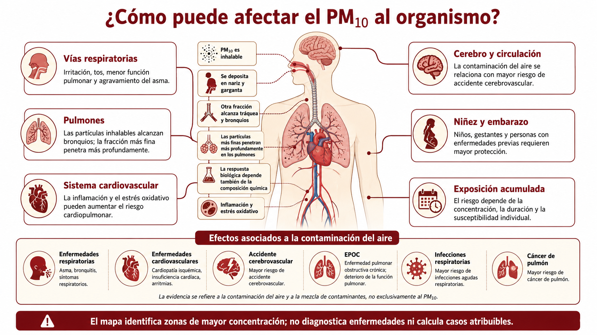

*Figura. Esquema de los principales sistemas que pueden verse afectados por la contaminación particulada.*

La evidencia internacional relaciona la contaminación del aire con enfermedades respiratorias y cardiovasculares, accidente cerebrovascular, enfermedad pulmonar obstructiva crónica, infecciones respiratorias y cáncer de pulmón. Estas cifras se refieren a la contaminación del aire y a la mezcla de contaminantes, no exclusivamente al PM$_{10}$ (World Health Organization, 2024).

> **Grupos que requieren mayor protección**
>
> Niños, adultos mayores, personas con asma, EPOC o cardiopatías, gestantes y quienes trabajan al aire libre pueden ser más sensibles. La susceptibilidad no significa que todas estas personas enfermarán, sino que una misma concentración puede representar un riesgo mayor para ellas.

### Dimensión mundial y valores de referencia

La OMS estimó que en 2019 el 99% de la población mundial vivía en lugares donde no se cumplían sus directrices de calidad del aire. La contaminación exterior se asoció con 4.2 millones de muertes prematuras y la contaminación exterior más la doméstica con 6.7 millones por año (World Health Organization, 2024). Estas cifras describen el problema mundial de la contaminación atmosférica y no deben interpretarse como muertes causadas únicamente por PM$_{10}$.

Para PM$_{10}$, la directriz anual de la OMS es 15 $\mu\mathrm{g}\,\mathrm{m}^{-3}$ y la directriz de 24 horas es 45 $\mu\mathrm{g}\,\mathrm{m}^{-3}$ (World Health Organization, 2021). La Unión Europea mantiene como referencia transitoria 40 $\mu\mathrm{g}\,\mathrm{m}^{-3}$ para la media anual y 50 $\mu\mathrm{g}\,\mathrm{m}^{-3}$ para la media diaria, con hasta 35 superaciones. Los valores que deberán alcanzarse en 2030 son 20 $\mu\mathrm{g}\,\mathrm{m}^{-3}$ anuales y 45 $\mu\mathrm{g}\,\mathrm{m}^{-3}$ diarios, con hasta 18 superaciones (European Parliament and Council of the European Union, 2024).

  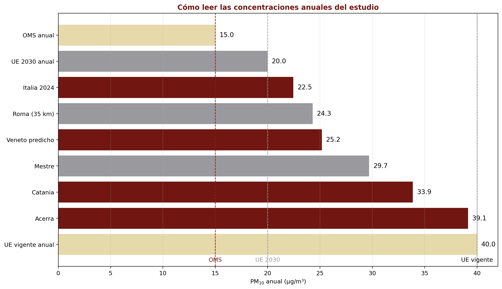

*Figura. Comparación entre referencias anuales y algunos resultados del estudio.*

> **Cumplir una norma no significa riesgo cero**
>
> Las normas legales y las directrices sanitarias responden a funciones diferentes. Una concentración inferior al límite legal vigente puede seguir siendo superior a la guía de salud de la OMS. Por esta razón, el informe compara los resultados con varias referencias y no usa una sola etiqueta de “seguro” o “peligroso”.

## El conjunto de datos: de la estación de monitoreo a la base analítica

### Fuente oficial

El dataset fue descargado del *EEA Air Quality Download Service*, portal de la Agencia Europea de Medio Ambiente. Se seleccionó Italia, el contaminante PM$_{10}$ y el flujo E1a, correspondiente a mediciones primarias validadas reportadas por los países. El portal permite descargar series desde 2013 y diferenciar datos validados E1a de datos más recientes aún no validados (European Environment Agency, 2026a; European Environment Agency, 2026b).

> **Inventario reconstruido**
>
> | Indicador                         | Resultado |
> |:----------------------------------|----------:|
> | Archivos Parquet                  |       569 |
> | Filas declaradas en los archivos  | 8,973,629 |
> | Códigos de estación identificados |       567 |
> | Periodo realmente observado       | 2013–2024 |
> | Año completamente ausente         |      2014 |
> | Registros estación–día            | 1,726,243 |
> | Estaciones válidas para 2024      |       554 |

### Cómo funciona una estación de PM$_{10}$

Un equipo de alto volumen aspira aire a un caudal controlado. El cabezal de entrada actúa como selector de tamaño: las partículas demasiado grandes son separadas y la fracción PM$_{10}$ continúa hacia un filtro. La masa acumulada en el filtro puede determinarse mediante procedimientos gravimétricos. Existen también métodos automáticos y ópticos, por lo que el inventario contiene nombres como BETA, gravimétrico, TEOM, nephelometry y OPC. La Directiva europea identifica EN 12341:2023 como método gravimétrico de referencia para PM$_{10}$ (European Parliament and Council of the European Union, 2024).

  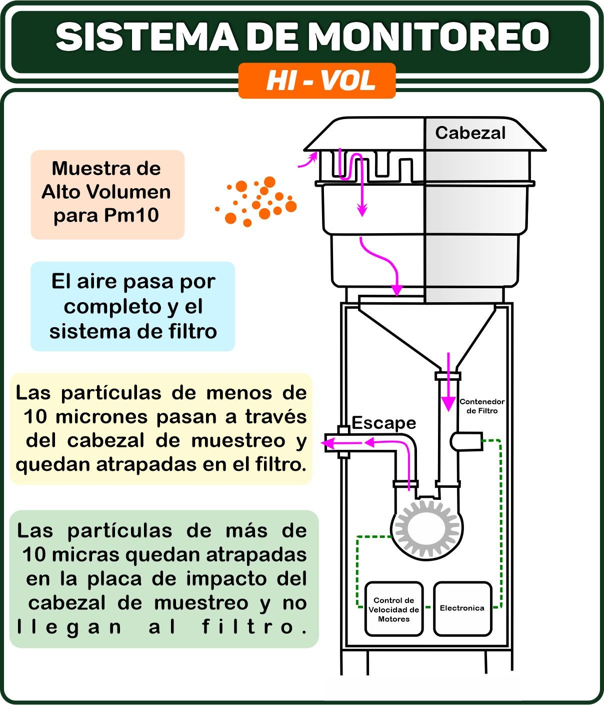

*Figura. Esquema pedagógico de un muestreador de alto volumen para PM$_{10}$, proporcionado para el estudio.*

> **Alcance de la imagen**
>
> La figura explica el principio general de selección y captura de partículas. No significa que las 567 estaciones italianas utilicen exactamente el mismo equipo. El dataset incluye diferentes métodos instrumentales y la comparabilidad depende de los procedimientos de validación y equivalencia aplicados por las redes oficiales.

### Cómo se transforma un archivo en un valor diario

El procesamiento no usa directamente todas las lecturas. Primero se aplican reglas de admisibilidad:

$$
\begin{aligned}
A_{ift}
&=
I\left\{
\mathrm{Validity}=1,\,
\mathrm{Verification}=1,\,
Y_{ift}\ge 0
\right\}
\end{aligned}
$$

donde $Y_{ift}$ es una lectura del flujo $f$ en la estación $i$ y el tiempo $t$. La función $I\{\cdot\}$ vale 1 cuando todas las condiciones se cumplen y 0 en caso contrario.

Si las lecturas son horarias, se exige un mínimo de 18 horas válidas en el día. La media diaria por flujo es:

$$
\overline{Y}_{ifd}
=
\frac{1}{n_{ifd}}
\sum_{t\in d} A_{ift}Y_{ift},
\qquad n_{ifd}\ge 18
$$

Cuando una estación tiene más de un flujo o método el mismo día, se toma la mediana entre flujos. Esta decisión reduce la influencia de un valor extremo proveniente de un único instrumento.

  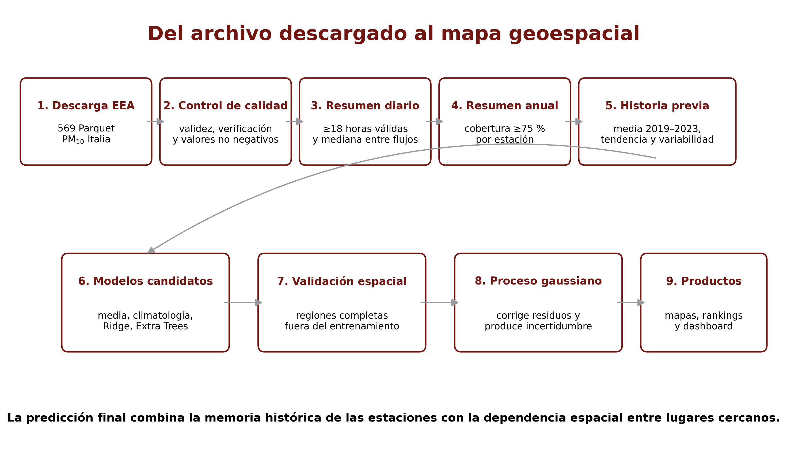

*Figura. Secuencia completa desde los archivos EEA hasta los mapas y dashboards.*

### Cobertura temporal

Para cada estación y año se calcula:

$$
C_{ia}=\frac{n_{ia}}{D_a}
$$

donde $n_{ia}$ es el número de días con dato y $D_a$ es el número de días del año. Se considera válido un año de estación cuando $C_{ia}\ge0.75$.

|  Año | Estaciones con datos | Estaciones válidas | Días medios | Máximo de días | Año ausente |
|-----:|---------------------:|-------------------:|------------:|---------------:|:------------|
| 2013 |                  273 |                248 |       326.5 |            365 | No          |
| 2014 |                    – |                  – |           – |              – | Sí          |
| 2015 |                  386 |                360 |       332.7 |            365 | No          |
| 2016 |                  413 |                361 |       328.6 |            366 | No          |
| 2017 |                  431 |                405 |       334.2 |            365 | No          |
| 2018 |                  448 |                422 |       335.0 |            365 | No          |
| 2019 |                  471 |                445 |       333.9 |            365 | No          |
| 2020 |                  491 |                471 |       342.4 |            366 | No          |
| 2021 |                  530 |                506 |       340.9 |            365 | No          |
| 2022 |                  545 |                535 |       343.6 |            365 | No          |
| 2023 |                  555 |                549 |       344.8 |            365 | No          |
| 2024 |                  566 |                554 |       343.0 |            365 | No          |

  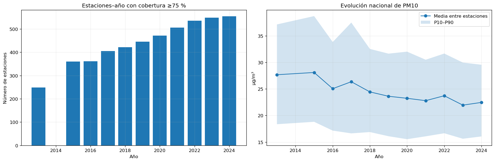

*Figura. Crecimiento de la red válida y evolución de la concentración media entre estaciones.*

  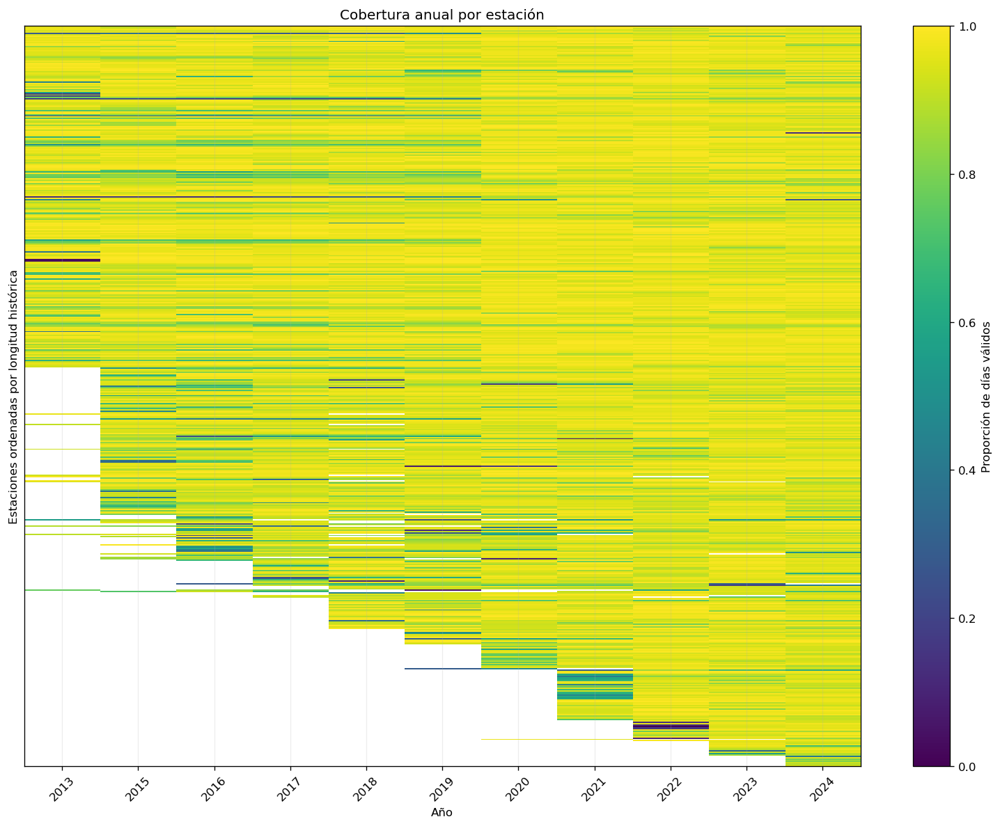

*Figura. Matriz de cobertura por estación y año. El espacio vacío de 2014 muestra la discontinuidad completa.*

### Coordenadas y regiones

Las coordenadas de las estaciones se obtienen del servicio espacial oficial de la EEA. Las estaciones se unen a las regiones NUTS 2 de Eurostat, que son divisiones territoriales comparables para estadísticas regionales europeas (Eurostat GISCO, 2024). Para calcular distancias se usa EPSG:3035, una proyección métrica adecuada para Europa.

  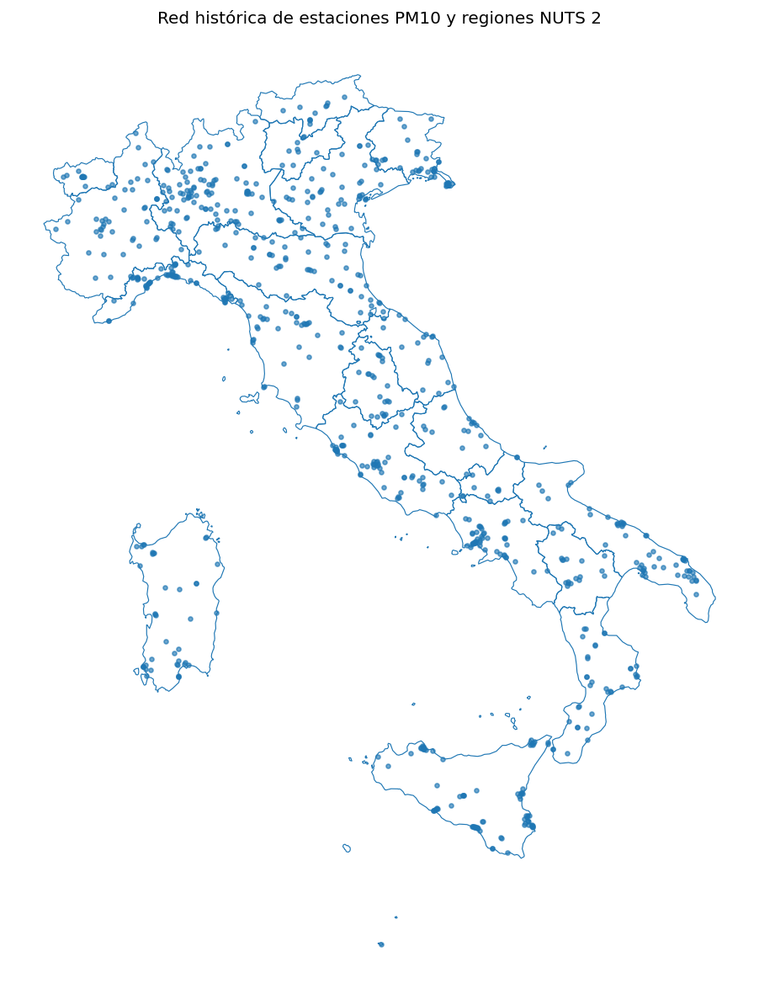

*Figura. Red histórica de estaciones PM$_{10}$ y límites regionales NUTS 2 de Italia.*

> **¿Por qué es importante la ubicación?**
>
> Dos estaciones con concentraciones parecidas pueden estar próximas y compartir condiciones atmosféricas. Si se ignora esta relación, el análisis trata cada estación como si fuera independiente. La estadística espacial incorpora explícitamente la distancia y permite estimar lugares donde no existe una estación.

## Del dato al modelo geoespacial

### Qué problema intenta resolver el modelo

El objetivo no es solamente ordenar estaciones. Se desea construir una superficie continua de PM$_{10}$ para Italia en 2024. Una superficie continua asigna una estimación a cada punto de una malla nacional, incluso donde no hay equipo de medición.

El modelo utiliza dos ideas:

1.  **Memoria histórica:** una estación que fue alta durante varios años tiende a conservar parte de ese patrón territorial.

2.  **Dependencia espacial:** lugares próximos suelen parecerse más que lugares muy alejados, aunque no siempre.

> **Analogía intuitiva**
>
> Para estimar la temperatura de un lugar sin termómetro, sería razonable observar las estaciones cercanas y también conocer el clima habitual de la zona. El modelo de PM$_{10}$ hace algo semejante: combina el comportamiento histórico con la proximidad espacial y añade una medida de incertidumbre.

> **Términos geoespaciales que se utilizarán**
>
> **Ubicación $s$:** punto del territorio definido por sus coordenadas.
>
> **Malla:** conjunto ordenado de puntos sobre Italia donde el modelo calcula resultados.
>
> **Superficie continua:** mapa en el que cada punto de la malla recibe una estimación, no solamente las estaciones.
>
> **Interpolación:** estimación en lugares sin medición directa utilizando la información de lugares observados.
>
> **Covariable:** dato que ayuda a explicar o predecir la concentración, como la historia reciente de una estación.
>
> **Residuo:** diferencia entre el valor observado y la parte ya explicada por el modelo.
>
> **Incertidumbre predictiva:** medida de cuánto puede variar razonablemente la predicción; no es contaminación adicional.

### Construcción de las variables históricas

Para cada estación se usan únicamente años anteriores a 2024, evitando que el modelo “vea” el resultado que debe predecir. La climatología reciente es:

$$
H_i
=
\frac{1}{m_i}
\sum_{a=2019}^{2023}
\overline{Y}_{ia}
$$

con los años válidos disponibles. También se calcula una media histórica más amplia, una desviación estándar, el número de años y una tendencia lineal:

$$
\overline{Y}_{ia}=\alpha_i+b_i a+e_{ia}
$$

El parámetro $b_i$ expresa el cambio promedio anual de la estación. Un valor negativo indica descenso histórico y uno positivo, aumento.

| Estación | Región  | PM10 2024 | Media 2019–2023 | Tendencia | Cobertura |
|:---------|:--------|----------:|----------------:|----------:|----------:|
| IT1619A  | Veneto  |     21.47 |           22.03 |    -0.580 |     0.984 |
| IT1187A  | Toscana |     28.21 |           28.57 |     0.006 |     0.995 |
| IT0872A  | Lazio   |     34.36 |           37.52 |    -1.028 |     0.975 |
| IT2252A  | Lazio   |     18.80 |           18.19 |    -0.003 |     0.844 |
| IT1795A  | Marche  |     17.16 |           17.25 |     0.089 |     0.926 |

Ejemplo de covariables históricas mostradas por el notebook.

  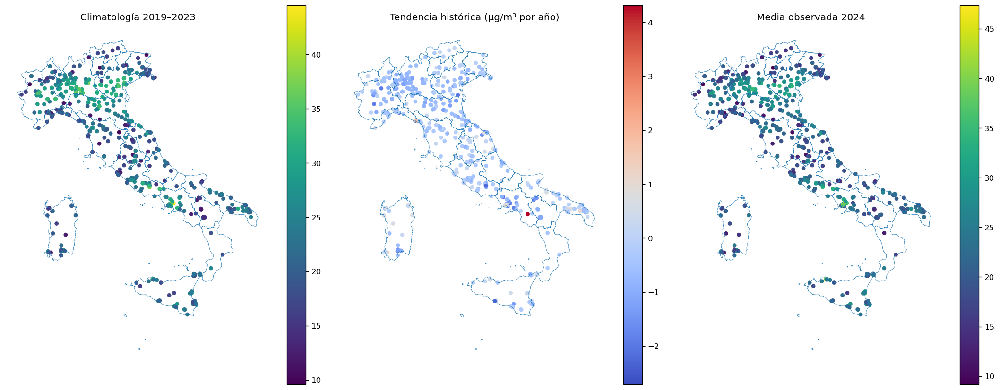

*Figura. Climatología reciente, tendencia histórica y media observada de 2024.*

### El modelo en dos etapas

  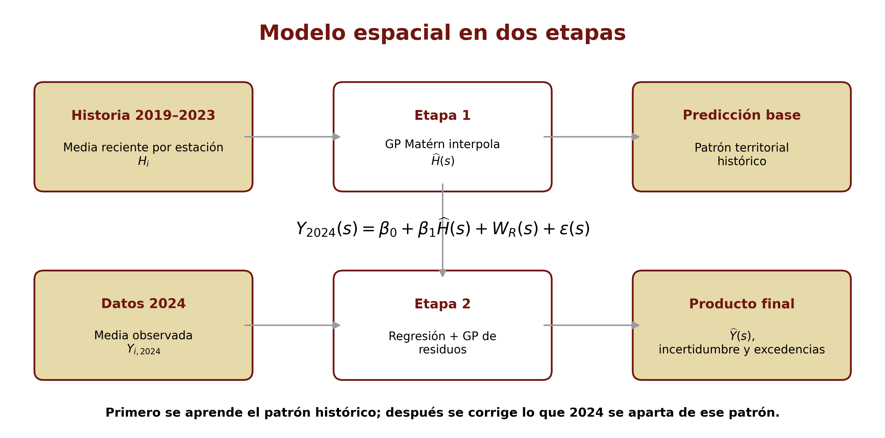

*Figura. Estructura conceptual de la superficie nacional estimada.*

En la primera etapa, un proceso gaussiano interpola la climatología $H_i$ y produce $\widehat H(s)$. En la segunda, la concentración de 2024 se relaciona con esa climatología y se modela espacialmente lo que todavía queda sin explicar:

$$
Y_{2024}(s)
=
\beta_0+\beta_1\widehat{H}(s)+W_R(s)+\varepsilon(s)
$$

$W_R(s)$ es la corrección espacial residual. $\varepsilon(s)$ representa variación local o error no explicado.

> **¿Para qué sirve la segunda etapa?**
>
> Dos lugares con una historia similar pueden comportarse de manera diferente en 2024. La corrección residual permite ajustar esas diferencias espaciales recientes en lugar de copiar mecánicamente el promedio 2019–2023.

### Formulación estadística formal

> **Definición — Proceso gaussiano.**
>
> Un proceso gaussiano $\{W(s):s\in D\}$ es una colección de variables aleatorias indexadas por el espacio. Cualquier conjunto finito $W(s_1),\ldots,W(s_n)$ tiene una distribución normal multivariada. El proceso se especifica mediante una función media y una función de covarianza.

**Teorema — Propiedad de dimensión finita.**

Si $W(s)$ es un proceso gaussiano con media $\mu(s)$ y covarianza $\kappa(s,s')$, entonces:

$$
\mathbf{W}
=
\begin{bmatrix}
W(s_1) & \cdots & W(s_n)
\end{bmatrix}^{\top}
\sim
\mathcal{N}_n\!\left(\boldsymbol{\mu},\boldsymbol{\Sigma}\right)
$$

donde $\mu_i=\mu(s_i)$ y $\Sigma_{ij}=\kappa(s_i,s_j)$.

El modelo lineal espacial general es:

$$
\begin{aligned}
Y(s_i)
&=
\mathbf{x}(s_i)^{\top}\boldsymbol{\beta}
+W(s_i)+\varepsilon_i, \\
\varepsilon_i
&\overset{\mathrm{iid}}{\sim}
\mathcal{N}(0,\tau^2)
\end{aligned}
$$

La parte $\mathbf{x}(s_i)^\top\boldsymbol{\beta}$ representa la variación explicada. $W(s_i)$ representa una superficie espacial latente y $\tau^2$ la variación no espacial.

#### Estacionariedad e isotropía

Un proceso es estacionario cuando su distribución no cambia al trasladar el sistema de coordenadas. Es isotrópico cuando la dependencia depende de la distancia, pero no de la dirección. Estas condiciones simplifican la covarianza:

$$
\operatorname{Cov}\!\left\{W(s),W(s')\right\}
=
\sigma^2\rho\!\left(\lVert s-s'\rVert;\phi,\nu\right)
$$

En Italia estas hipótesis son aproximaciones, porque montañas, costas e islas pueden crear comportamientos diferentes por dirección y región.

#### Semivariograma

El semivariograma cuantifica cuánto difieren dos observaciones separadas por una distancia:

$$
\gamma(s,s')
=
\frac{1}{2}
\operatorname{Var}\!\left\{W(s)-W(s')\right\}
$$

Su estimador por intervalos de distancia es:

$$
\widehat{\gamma}(d)
=
\frac{1}{2N(d)}
\sum_{(i,j)\in N(d)}
\left\{y(s_i)-y(s_j)\right\}^{2}
$$

En lenguaje sencillo, si $\widehat{\gamma}(d)$ aumenta con la distancia, las estaciones lejanas son menos parecidas.

#### Covarianza Matérn

El modelo usa una función Matérn con $\nu=3/2$:

$$
\rho(h;\phi,\nu)
=
\frac{2^{1-\nu}}{\Gamma(\nu)}
\left(
\frac{\sqrt{2\nu}\,h}{\phi}
\right)^{\nu}
K_{\nu}\!\left(
\frac{\sqrt{2\nu}\,h}{\phi}
\right)
$$

donde $h=\|s-s'\|$. $\phi$ controla la escala espacial y $\nu$ la suavidad. $K_\nu$ es una función de Bessel modificada.

> **Traducción de los parámetros**
>
> **Amplitud:** tamaño de la variación espacial. **Escala o longitud:** rapidez con que disminuye la semejanza al aumentar la distancia. **Ruido o nugget:** variación muy local, error de medición o factores que el modelo no explica. **$\nu$:** suavidad de la superficie; $\nu=1.5$ permite cambios graduales sin imponer una superficie excesivamente lisa.

#### Inferencia y predicción

Para el modelo matricial

$$
\mathbf{Y}
\sim
\mathcal{N}_n\!\left(
\mathbf{X}\boldsymbol{\beta},
\sigma^2\mathbf{R}_{\phi}+\tau^2\mathbf{I}
\right)
$$

los parámetros se ajustan maximizando la verosimilitud. La predicción en nuevos lugares se obtiene mediante la distribución normal condicional:

$$
\mathbf{Y}_{*}\mid\mathbf{Y}=\mathbf{y}
\sim
\mathcal{N}\!\left(
\boldsymbol{\mu}_{*\mid y},
\boldsymbol{\Sigma}_{*\mid y}
\right)
$$

$$
\boldsymbol{\mu}_{*\mid y}
=
\mathbf{X}_{*}\boldsymbol{\beta}
+
\boldsymbol{\Sigma}_{*,y}
\left(
\boldsymbol{\Sigma}_{y}+\tau^2\mathbf{I}
\right)^{-1}
\left(
\mathbf{y}-\mathbf{X}\boldsymbol{\beta}
\right)
$$

$$
\boldsymbol{\Sigma}_{*\mid y}
=
\tau^2\mathbf{I}
+
\boldsymbol{\Sigma}_{*}
-
\boldsymbol{\Sigma}_{*,y}
\left(
\boldsymbol{\Sigma}_{y}+\tau^2\mathbf{I}
\right)^{-1}
\boldsymbol{\Sigma}_{y,*}
$$

La primera expresión produce el mapa de concentración. La segunda produce el mapa de incertidumbre.

### Parámetros utilizados y estimados

| Parámetro                     | Valor     | Interpretación                                                                      |
|:------------------------------|:----------|:------------------------------------------------------------------------------------|
| Año objetivo                  | 2024      | Año para el que se construye la superficie final.                                   |
| Historia reciente             | 2019–2023 | Promedio previo usado como memoria de cada estación.                                |
| Cobertura anual mínima        | 75%       | Una estación–año se utiliza si tiene datos en al menos tres cuartas partes del año. |
| Malla nacional                | 12.5 km   | Separación entre puntos donde se calcula la predicción.                             |
| Pliegues espaciales           | 5         | Número de particiones territoriales utilizadas en la validación.                    |
| Matérn $\nu$                  | 1.5       | Parámetro que controla la suavidad del campo espacial.                              |
| GP histórico: amplitud        | $0.884^2$ | Magnitud estimada de la variación espacial de la climatología.                      |
| GP histórico: escala          | 38.1 km   | Distancia característica a la que la semejanza espacial disminuye con rapidez.      |
| GP histórico: ruido           | 0.228     | Variación local no explicada durante la interpolación histórica.                    |
| GP residual: amplitud         | $0.508^2$ | Variación espacial que permanece después de incorporar la historia.                 |
| GP residual: escala           | 161 km    | Distancia característica de la estructura espacial residual de 2024.                |
| GP residual: ruido            | 0.784     | Componente local que la superficie residual no logra explicar.                      |
| Radio urbano                  | 25 km     | Distancia máxima para asociar una estación con el centro de una ciudad.             |
| Estaciones mínimas por ciudad | 2         | Requisito para incluir un entorno urbano en el ranking.                             |

> **Qué no es un parámetro causal**
>
> La escala de 161 km no significa que una fuente contamine exactamente hasta esa distancia. Describe la estructura estadística de los residuos del conjunto analizado. No identifica mecanismos físicos de transporte ni demuestra causalidad.

## ¿Qué tan bien funciona el modelo?

### Validación espacial

Una validación aleatoria puede ser demasiado optimista porque coloca estaciones cercanas en entrenamiento y prueba. El notebook usa cinco pliegues espaciales: se retienen regiones completas, se ajusta el modelo con las demás y luego se predice la región excluida. Así se evalúa una tarea más difícil y más parecida a predecir un territorio poco observado.

> **Qué significa “fuera de muestra”**
>
> El modelo se evalúa con datos que no utilizó para estimar sus parámetros. La validación espacial añade una condición más exigente: los puntos de prueba pertenecen a regiones separadas del entrenamiento.

### Indicadores

Sea $y_i$ el valor observado, $\widehat y_i$ la predicción y $n$ el número de estaciones evaluadas.

$$
\begin{aligned}
\operatorname{RMSE}
&=
\sqrt{\frac{1}{n}\sum_{i=1}^{n}\left(y_i-\widehat{y}_i\right)^2}, \\
\operatorname{MAE}
&=
\frac{1}{n}\sum_{i=1}^{n}\left|y_i-\widehat{y}_i\right|, \\
R^2
&=
1-
\frac{\sum_i\left(y_i-\widehat{y}_i\right)^2}
{\sum_i\left(y_i-\overline{y}\right)^2}, \\
\operatorname{Sesgo}
&=
\frac{1}{n}\sum_i\left(\widehat{y}_i-y_i\right)
\end{aligned}
$$

> **Cómo interpretar las métricas**
>
> RMSE y MAE se expresan en $\mu\mathrm{g}\,\mathrm{m}^{-3}$: cuanto menores, mejor. El RMSE penaliza más los errores grandes. $R^2$ compara el modelo con una predicción basada en la media: un valor positivo indica mejora y un valor cercano a 1, mayor capacidad explicativa. El sesgo muestra si el modelo tiende a sobrestimar o subestimar.

| Modelo                        |  RMSE |   MAE |  $R^2$ |  Sesgo |
|:------------------------------|------:|------:|-------:|-------:|
| Ridge + GP residual           | 2.718 | 1.884 |  0.696 |  0.140 |
| Ridge histórico               | 2.747 | 1.901 |  0.690 |  0.148 |
| Climatología reciente directa | 2.863 | 1.975 |  0.670 | -0.100 |
| Extra Trees histórico         | 2.909 | 2.032 |  0.648 | -0.298 |
| Media de entrenamiento        | 5.391 | 4.127 | -0.129 |  0.192 |

Desempeño medio por validación espacial.

  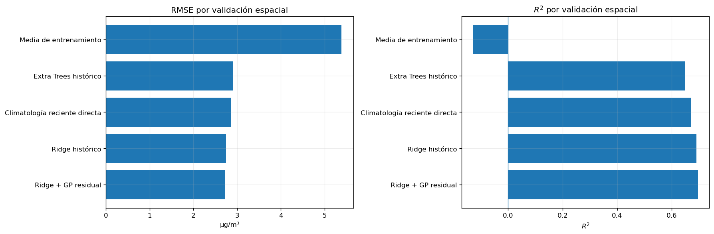

*Figura. Comparación de RMSE y <em>R</em>2 entre los modelos candidatos.*

> **Evaluación del mejor modelo**
>
> El modelo Ridge más proceso gaussiano residual obtuvo:

$$
\begin{aligned}
\operatorname{RMSE} &= 2.718, \\
\operatorname{MAE} &= 1.884, \\
R^2 &= 0.696, \\
\operatorname{Sesgo} &= 0.140
\end{aligned}
$$

> El RMSE es 49.6% menor que el de la media de entrenamiento. El $R^2$ indica que el modelo reproduce aproximadamente el 70% de la variación observada en la validación espacial. El sesgo es pequeño frente a una media nacional cercana a 22.5 $\mu\mathrm{g}\,\mathrm{m}^{-3}$.

> **Conclusión correcta sobre la calidad del modelo**
>
> El desempeño es bueno para describir y predecir el patrón anual de estaciones y regiones en 2024. No es suficiente para estimar exposición individual, calles específicas, horas del día o causas de contaminación. La escala nacional de 12.5 km tampoco debe interpretarse como un mapa urbano de alta resolución.

## Resultados nacionales y regionales

### Situación nacional en 2024

|  Año | Estaciones | Media | Mediana |   P10 |   P90 |
|-----:|-----------:|------:|--------:|------:|------:|
| 2013 |        248 | 27.66 |   28.06 | 18.35 | 37.13 |
| 2015 |        360 | 28.09 |   27.82 | 18.81 | 38.70 |
| 2016 |        361 | 25.04 |   25.00 | 17.15 | 33.82 |
| 2017 |        405 | 26.35 |   24.93 | 16.63 | 37.48 |
| 2018 |        422 | 24.43 |   24.26 | 16.88 | 32.52 |
| 2019 |        445 | 23.61 |   23.35 | 16.09 | 31.64 |
| 2020 |        471 | 23.23 |   22.50 | 15.53 | 32.01 |
| 2021 |        506 | 22.78 |   22.24 | 16.07 | 30.49 |
| 2022 |        535 | 23.71 |   23.26 | 16.65 | 31.65 |
| 2023 |        549 | 21.94 |   21.62 | 15.62 | 29.96 |
| 2024 |        554 | 22.46 |   22.07 | 16.05 | 29.54 |

En 2024, las 554 estaciones válidas presentan una media entre estaciones de 22.46 $\mu\mathrm{g}\,\mathrm{m}^{-3}$ y una mediana de 22.07 $\mu\mathrm{g}\,\mathrm{m}^{-3}$. El percentil 10 es 16.05 y el percentil 90 es 29.54 $\mu\mathrm{g}\,\mathrm{m}^{-3}$. La media nacional simple supera en aproximadamente 50% la guía anual de la OMS y en 12% el valor europeo previsto para 2030.

> **La media entre estaciones no es la media de la población**
>
> Las estaciones se ubican para vigilar ambientes urbanos, de tráfico, industriales o de fondo. Por ello, promediarlas con el mismo peso no equivale a promediar la exposición de todos los habitantes. Para una estimación poblacional sería necesario ponderar la superficie por densidad de población y movilidad.

### Superficie continua e incertidumbre

  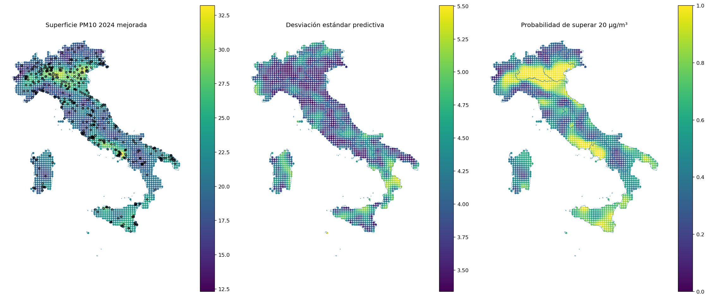

*Figura. Predicción nacional de PM$_{10}$, incertidumbre y probabilidad de superar 20 <em>μ</em>g m−3.*

El primer panel representa la concentración anual esperada. El segundo muestra la desviación estándar predictiva: valores altos indican menor precisión. El tercero muestra la probabilidad de que la concentración supere 20 $\mu\mathrm{g}\,\mathrm{m}^{-3}$. Una probabilidad alta no es una concentración adicional; expresa cuánta evidencia estadística existe de superar el umbral.

### Ranking regional NUTS 2

| NUTS 2 | Región         | Media predicha | DE predictiva | Prob. $>20$ | Media observada |
|:-------|:---------------|---------------:|--------------:|------------:|----------------:|
| ITH3   | Veneto         |          25.18 |          3.86 |       0.816 |           27.48 |
| ITC4   | Lombardia      |          23.90 |          3.83 |       0.723 |           26.32 |
| ITG1   | Sicilia        |          23.31 |          4.30 |       0.764 |           24.52 |
| ITF3   | Campania       |          22.44 |          4.05 |       0.642 |           26.80 |
| ITH5   | Emilia-Romagna |          22.14 |          3.85 |       0.658 |           23.44 |
| ITI4   | Lazio          |          21.93 |          3.85 |       0.635 |           22.36 |
| ITF6   | Calabria       |          21.14 |          4.82 |       0.588 |           17.82 |
| ITF4   | Puglia         |          20.94 |          4.03 |       0.590 |           21.59 |

Regiones con mayor media predicha de PM$_{10}$ en 2024.

| NUTS 2 | Región         | Estaciones | Días $>50$ | Tendencia anual |
|:-------|:---------------|-----------:|-----------:|----------------:|
| ITH3   | Veneto         |         33 |       40.3 |          -0.410 |
| ITC4   | Lombardia      |         66 |       37.6 |          -0.746 |
| ITG1   | Sicilia        |         49 |       18.3 |          -0.183 |
| ITF3   | Campania       |         30 |       26.7 |          -0.645 |
| ITH5   | Emilia-Romagna |         43 |       22.3 |          -0.657 |
| ITI4   | Lazio          |         50 |       15.7 |          -0.322 |
| ITF6   | Calabria       |          3 |        8.0 |          -0.281 |
| ITF4   | Puglia         |         45 |        9.4 |          -0.080 |

Regiones con mayor media predicha de PM$_{10}$ en 2024.

DE predictiva: desviación estándar de la predicción; valores mayores indican más incertidumbre. Prob. $>20$: probabilidad media estimada de superar 20 $\mu\mathrm{g}\,\mathrm{m}^{-3}$. Días $>50$: promedio anual de días por estación con concentración diaria superior a 50 $\mu\mathrm{g}\,\mathrm{m}^{-3}$. La tendencia está expresada en $\mu\mathrm{g}\,\mathrm{m}^{-3}$ por año.

  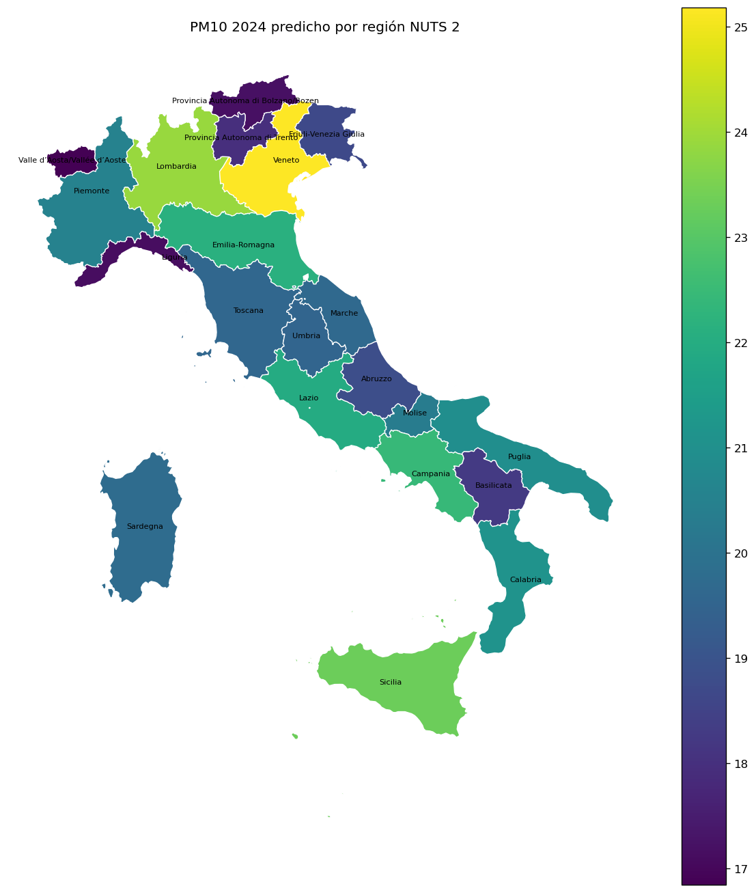

*Figura. Coropleta de concentración predicha por región NUTS 2.*

  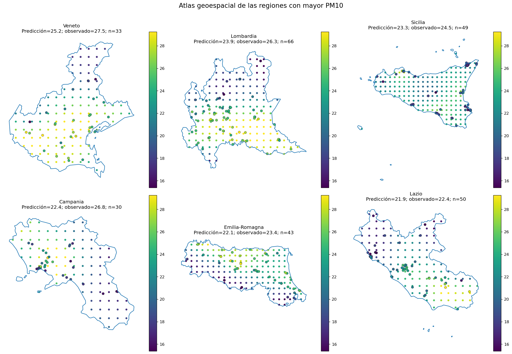

*Figura. Atlas de las regiones con mayor concentración predicha.*

#### Veneto

Veneto encabeza el ranking con 25.18 $\mu\mathrm{g}\,\mathrm{m}^{-3}$ predichos y 27.48 $\mu\mathrm{g}\,\mathrm{m}^{-3}$ observados en 33 estaciones. La probabilidad regional media de superar 20 $\mu\mathrm{g}\,\mathrm{m}^{-3}$ es 0.816. La tendencia histórica media es negativa, lo que indica mejora, pero el nivel de 2024 continúa 68% por encima de la guía anual de la OMS.

#### Lombardia

Lombardia presenta 23.90 $\mu\mathrm{g}\,\mathrm{m}^{-3}$ predichos, 26.32 $\mu\mathrm{g}\,\mathrm{m}^{-3}$ observados y 66 estaciones. La amplia red mejora la base descriptiva, aunque no elimina la necesidad de considerar meteorología y diferencias entre tráfico, fondo urbano e industria.

#### Sicilia y Campania

Sicilia alcanza 23.31 $\mu\mathrm{g}\,\mathrm{m}^{-3}$ predichos y Campania 22.44 $\mu\mathrm{g}\,\mathrm{m}^{-3}$. Campania muestra una diferencia relevante entre media predicha y media observada. Esto puede reflejar estaciones ubicadas en microambientes más contaminados que la superficie regional suavizada.

#### Emilia-Romagna y Lazio

Emilia-Romagna y Lazio superan 21.9 $\mu\mathrm{g}\,\mathrm{m}^{-3}$ predichos. En Lazio se encuentra Roma; la escala regional combina áreas metropolitanas y territorios menos densos, por lo que no representa una concentración uniforme en toda la región.

### Cambios a través del tiempo

  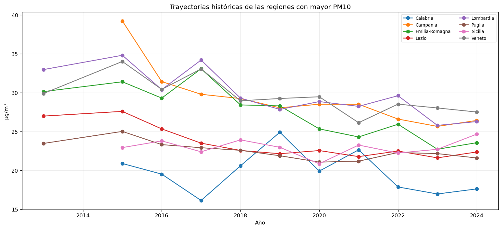

*Figura. Trayectorias históricas de las regiones con mayor concentración en 2024.*

  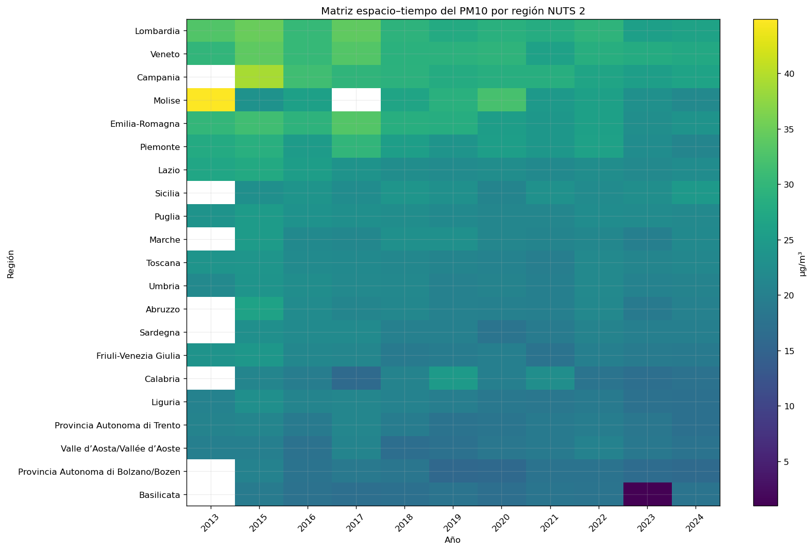

*Figura. Matriz región–año de la concentración media de PM$_{10}$.*

La mayoría de las regiones principales muestra una tendencia descendente. Sin embargo, una reducción histórica no significa que el nivel actual sea bajo. El análisis debe considerar simultáneamente el nivel de 2024, la trayectoria y la frecuencia de días elevados.

## Ciudades y entornos urbanos

### Cómo se construyó el ranking

El notebook asigna cada estación al centro urbano italiano más próximo dentro de 25 km. Solo se incluyen entornos con al menos dos estaciones. La tabla debe interpretarse como un ranking de **áreas de proximidad a ciudades**, no como una media oficial calculada exactamente dentro de los límites municipales.

| Entorno urbano | Media | Mediana | Estaciones | Días \>50 | Tendencia | Población ref. |
|:---------------|------:|--------:|-----------:|----------:|----------:|---------------:|
| Acerra         | 39.14 |   39.14 |          2 |      70.0 |     0.101 |         59 910 |
| Catania        | 33.87 |   33.87 |          2 |      36.5 |     0.730 |        311 584 |
| Cassino        | 32.19 |   32.19 |          2 |      53.0 |     0.128 |         21 074 |
| Volla          | 31.99 |   31.99 |          2 |      41.5 |    -1.304 |         22 911 |
| Crema          | 30.85 |   31.22 |          3 |      53.3 |    -0.811 |         31 481 |
| Cremona        | 30.64 |   30.70 |          4 |      51.2 |    -0.574 |         71 223 |
| Maddaloni      | 30.53 |   30.53 |          2 |      37.0 |    -0.790 |         34 546 |
| Vicenza        | 30.22 |   30.22 |          2 |      53.5 |    -0.988 |        111 980 |
| Mestre         | 29.70 |   29.70 |          2 |      47.0 |    -0.418 |        147 662 |
| Brera          | 29.60 |   29.60 |          2 |      50.5 |    -0.873 |         18 492 |

  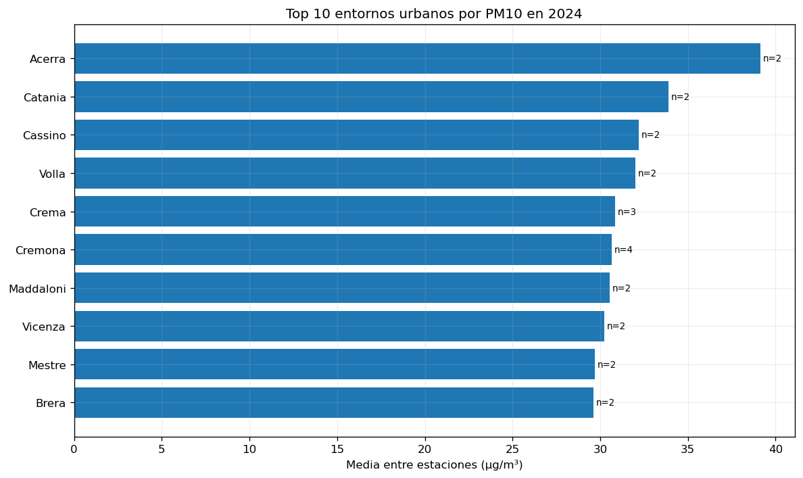

*Figura. Ranking de entornos urbanos por concentración media observada.*

  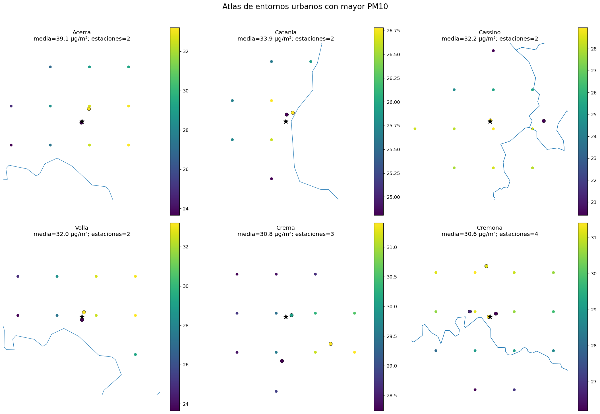

*Figura. Atlas geoespacial de los seis entornos urbanos principales.*

### Lectura de las ciudades con valores más altos

#### Acerra

Acerra registra 39.14 $\mu\mathrm{g}\,\mathrm{m}^{-3}$ a partir de dos estaciones. El valor equivale a 2.61 veces la guía anual de la OMS, supera en 96% el límite europeo de 2030 y se encuentra cerca del límite anual europeo transitorio de 40 $\mu\mathrm{g}\,\mathrm{m}^{-3}$. El promedio de 70 días por estación por encima de 50 $\mu\mathrm{g}\,\mathrm{m}^{-3}$ indica episodios frecuentes.

#### Catania

Catania presenta 33.87 $\mu\mathrm{g}\,\mathrm{m}^{-3}$ y una tendencia histórica positiva de 0.730 $\mu\mathrm{g}\,\mathrm{m}^{-3}$ por año. El resultado es especialmente relevante porque combina un nivel alto con ausencia de descenso en las estaciones consideradas.

#### Cassino y Volla

Cassino alcanza 32.19 $\mu\mathrm{g}\,\mathrm{m}^{-3}$ y Volla 31.99 $\mu\mathrm{g}\,\mathrm{m}^{-3}$. Volla muestra una fuerte tendencia negativa, lo que sugiere mejora histórica, aunque su nivel de 2024 sigue siendo elevado. Cassino muestra una tendencia ligeramente positiva.

#### Crema, Cremona, Maddaloni y Vicenza

Estos entornos se sitúan alrededor de 30–31 $\mu\mathrm{g}\,\mathrm{m}^{-3}$. Las tendencias son negativas, pero las medias todavía duplican aproximadamente la guía anual de la OMS.

### Venezia–Mestre

Mestre aparece en el ranking con 29.70 $\mu\mathrm{g}\,\mathrm{m}^{-3}$, dos estaciones y 47 días promedio por encima de 50 $\mu\mathrm{g}\,\mathrm{m}^{-3}$. La media es casi el doble de la guía OMS y 48% superior al valor europeo de 2030.

> **Venecia no es un único ambiente**
>
> La laguna, el centro histórico, Mestre, el puerto y los corredores viales poseen condiciones distintas. El valor del ranking representa estaciones cercanas a Mestre; no debe trasladarse sin más a cada residente o visitante del centro histórico.

### Roma

Roma no aparece entre las diez primeras bajo la regla estricta de 25 km y mínimo de dos estaciones del ranking mostrado. Un análisis de sensibilidad territorial de 35 km, realizado con los resúmenes de 2024, reunió 17 estaciones y produjo aproximadamente 24.30 $\mu\mathrm{g}\,\mathrm{m}^{-3}$. Este valor es 62% superior a la guía OMS y 21.5% superior al valor europeo de 2030.

> **Qué significa para los habitantes de Roma**
>
> La cifra no indica que cada persona respire exactamente 24.30 $\mu\mathrm{g}\,\mathrm{m}^{-3}$. La exposición cambia por barrio, cercanía a vías, horario, trabajo, actividad física y ventilación interior. El resultado sí indica que una parte importante del entorno metropolitano merece seguimiento y una cartografía urbana de mayor resolución.

### Consecuencias potenciales para la población

Las ciudades con medias anuales próximas a 30–39 $\mu\mathrm{g}\,\mathrm{m}^{-3}$ presentan una presión ambiental claramente superior a las referencias sanitarias. Para los habitantes, la principal preocupación no es un único día aislado, sino la combinación de exposición repetida, episodios diarios y susceptibilidad individual.

Las medidas de salud pública deben concentrarse en:

- información clara durante episodios elevados;

- protección de escuelas, hospitales y residencias;

- control de polvo resuspendido, obras y corredores de tráfico;

- evaluación de fuentes industriales y agrícolas;

- reducción sostenida de la media anual, incluso si se cumple el límite legal transitorio.

## Dashboard y productos interactivos

### Dashboard cartográfico

El dashboard Folium permite activar o desactivar capas:

- regiones NUTS 2 coloreadas por media predicha;

- estaciones de 2024 con concentración, región y tendencia;

- superficie suavizada como mapa de calor;

- marcadores de las ciudades con mayor concentración;

- ventanas emergentes y leyenda interactiva.

> **Cómo usar el mapa**
>
> Primero observe la región completa. Después active las estaciones para comprobar si el color regional está apoyado por varios puntos o por pocos. Finalmente consulte la incertidumbre y recuerde que las zonas alejadas de estaciones tienen menor respaldo directo.

### Dashboard analítico

  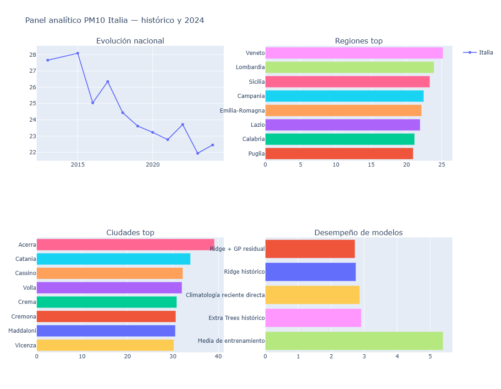

*Figura. Dashboard analítico con evolución nacional, regiones, ciudades y desempeño de modelos.*

El panel resume cuatro preguntas:

1.  ¿Cómo ha cambiado el promedio nacional?

2.  ¿Qué regiones presentan mayor concentración predicha?

3.  ¿Qué entornos urbanos presentan mayor media observada?

4.  ¿Qué modelo predice mejor fuera de las regiones usadas para entrenar?

Los archivos HTML se entregan junto con el libro. El dashboard es una herramienta de exploración y comunicación; los valores oficiales deben contrastarse siempre con los datos de las autoridades competentes.

## Limitaciones, mejoras y conclusiones

### Limitaciones

1.  **Año 2014 ausente.** No puede interpretarse una trayectoria continua sin reconocer esta brecha.

2.  **Falta de meteorología.** Viento, lluvia, temperatura y capa límite explican parte importante de la variación.

3.  **Altitud no disponible.** La variable fue excluida automáticamente porque no contenía observaciones utilizables.

4.  **Estacionariedad aproximada.** Un único modelo Matérn no reproduce todas las barreras de Alpes, Apeninos, costas e islas.

5.  **Resolución nacional.** La malla de 12.5 km es adecuada para una lectura nacional, no para una calle o barrio.

6.  **Ranking urbano de proximidad.** Las ciudades se definen por distancia al centro urbano y no por límites administrativos.

7.  **Sin ponderación poblacional.** Las medias regionales no incorporan cuántas personas viven en cada celda.

8.  **Sin causalidad.** El modelo describe asociaciones espaciales y temporales; no identifica fuentes causales.

### Mejoras recomendadas

La siguiente versión debe incorporar meteorología diaria, elevación, uso del suelo CORINE, carreteras, tráfico, emisiones industriales, agricultura, población y datos satelitales. También debe evaluar anisotropía y modelos no estacionarios o espacio-temporales.

Una extensión diaria puede escribirse como:

$$
\log\!\left\{1+Y(s,t)\right\}
=
\mathbf{x}(s,t)^{\top}\boldsymbol{\beta}
+W(s)+U(t)+V(s,t)+\varepsilon(s,t)
$$

donde $U(t)$ representa la dependencia temporal y $V(s,t)$ una interacción espacio–tiempo.

### Conclusiones

> **Conclusión general**
>
> Italia muestra una reducción histórica de PM$_{10}$, pero la media de 2024 entre estaciones válidas, 22.46 $\mu\mathrm{g}\,\mathrm{m}^{-3}$, continúa por encima de la guía anual de la OMS y del valor europeo previsto para 2030. El problema no es uniforme: Veneto, Lombardia, Sicilia y Campania concentran valores regionales altos, mientras Acerra y Catania encabezan el ranking urbano.

1.  La ampliación histórica mejora de forma sustancial la predicción de 2024.

2.  El mejor modelo alcanza $R^2=0.696$ en una validación espacial exigente.

3.  La historia reciente de una estación es una señal predictiva más potente que las coordenadas por sí solas.

4.  La incertidumbre debe mostrarse junto con cada mapa de concentración.

5.  Los resultados son útiles para priorizar monitoreo y gestión, pero no para diagnosticar personas.

6.  La próxima etapa debe ser un modelo diario espacio–temporal con covariables ambientales y exposición ponderada por población.

## Tablas completas mostradas por el notebook

### Vista previa del inventario de archivos

| Archivo                                        | Estación | Método | Inicio nominal |     Bytes |
|:-----------------------------------------------|:---------|:-------|:---------------|----------:|
| SPO.IT0063A_5_BETA_2000-05-05_00_00_00.parquet | IT0063A  | BETA   | 2000-05-05     |    52 465 |
| SPO.IT0187A_5_BETA_2002-01-28_00_00_00.parquet | IT0187A  | BETA   | 2002-01-28     |    53 569 |
| SPO.IT0267A_5_BETA_2005-04-07_00_00_00.parquet | IT0267A  | BETA   | 2005-04-07     |    76 493 |
| SPO.IT0448A_5_BETA_2003-02-22_00_00_00.parquet | IT0448A  | BETA   | 2003-02-22     |    53 219 |
| SPO.IT0459A_5_BETA_2006-02-20_00_00_00.parquet | IT0459A  | BETA   | 2006-02-20     | 1 218 748 |

Primeros archivos del inventario físico.

### Métodos instrumentales declarados

| Método de medición | Número de archivos |
|:-------------------|-------------------:|
| BETA               |                519 |
| gravi              |                 23 |
| nephelometry_beta  |                 12 |
| OPC-CMC            |                  5 |
| TEOM               |                  2 |
| LIGHT-SCAT         |                  2 |
| light-scat         |                  2 |
| GRAVIMETRIC        |                  2 |
| PALAS              |                  1 |
| nephelometry       |                  1 |

Número de archivos por método identificado en el nombre.

### Vista previa de esquemas

| Archivo                                        |  Filas | Campos                                                  |
|:-----------------------------------------------|-------:|:--------------------------------------------------------|
| SPO.IT0063A_5_BETA_2000-05-05_00_00_00.parquet |  4 017 | Samplingpoint, Pollutant, Start, End, Value, Unit, A... |
| SPO.IT0187A_5_BETA_2002-01-28_00_00_00.parquet |  4 017 | Samplingpoint, Pollutant, Start, End, Value, Unit, A... |
| SPO.IT0267A_5_BETA_2005-04-07_00_00_00.parquet |  4 017 | Samplingpoint, Pollutant, Start, End, Value, Unit, A... |
| SPO.IT0448A_5_BETA_2003-02-22_00_00_00.parquet |  4 017 | Samplingpoint, Pollutant, Start, End, Value, Unit, A... |
| SPO.IT0459A_5_BETA_2006-02-20_00_00_00.parquet | 87 648 | Samplingpoint, Pollutant, Start, End, Value, Unit, A... |

Primeros archivos de la auditoría de esquema Parquet.

### Errores de lectura

| Resultado de lectura                                                         |
|:-----------------------------------------------------------------------------|
| No se registraron archivos con error de lectura en la ejecución documentada. |

Resultado de la caché de errores de lectura.

### Manifiesto de productos

| Ruta relativa                                     |     Bytes | Extensión |
|:--------------------------------------------------|----------:|:----------|
| 01_inventario_parquet_historico.csv               |    45 170 | .csv      |
| 04_estaciones_modelo_historico_2024.geojson       |   538 452 | .geojson  |
| 05_metricas_cv_espacial.csv                       |     2 638 | .csv      |
| 06_predicciones_cv_espacial.csv                   |    96 922 | .csv      |
| 07_superficie_historica_mejorada_2024.geojson     |   913 102 | .geojson  |
| 08_ranking_regiones_nuts2.csv                     |     3 757 | .csv      |
| 09_ranking_ciudades_proximidad.csv                |    12 808 | .csv      |
| 10_resumen_nacional_anual.csv                     |       986 | .csv      |
| 11_resumen_estacion_anio.csv                      |   701 400 | .csv      |
| 12_covariables_historicas_pre2024.csv             |    64 619 | .csv      |
| 13_dataset_modelo_estaciones_2024.csv             |   179 049 | .csv      |
| cache\NUTS2_Italia_2024.geojson                   |   214 186 | .geojson  |
| cache\pm10_file_audit_historical.csv              |    81 707 | .csv      |
| cache\pm10_read_errors.csv                        |         2 | .csv      |
| cache\pm10_station_daily_historical.parquet       | 6 712 532 | .parquet  |
| cache\pm10_station_year_historical.parquet        |   214 486 | .parquet  |
| cache\schema_audit.csv                            |   157 544 | .csv      |
| figuras\01_cobertura_y_tendencia_nacional.png     |    62 353 | .png      |
| figuras\02_matriz_cobertura_estacion_anio.png     |   128 953 | .png      |
| figuras\03_red_estaciones_nuts2.png               |   161 931 | .png      |
| figuras\04_climatologia_tendencia_y_2024.png      |   372 443 | .png      |
| figuras\05_comparacion_modelos_historicos.png     |    40 338 | .png      |
| figuras\06_superficie_incertidumbre_probabilid... |   730 890 | .png      |
| figuras\07_coropleta_regiones_nuts2.png           |   147 031 | .png      |
| figuras\08_atlas_regiones_top.png                 |   482 458 | .png      |
| figuras\09_ranking_ciudades.png                   |    40 486 | .png      |
| figuras\10_atlas_ciudades_top.png                 |   167 764 | .png      |
| figuras\11_tendencias_regiones_top.png            |   149 122 | .png      |
| figuras\12_matriz_region_anio.png                 |    93 535 | .png      |
| mapas\Dashboard_Analitico_PM10_Italia.html        | 4 853 450 | .html     |
| mapas\Dashboard_PM10_Italia_Historico.html        |   809 566 | .html     |

## Notebook expresado en formato ALGORITHM

### Algoritmo 1. Resolución de la ruta e inventario reproducible

**Entrada:** Ruta local `C:\Users\Antonio\Downloads\ParquetFiles_ITALIA`

**Salida:** Inventario de archivos y metadatos nominales

1.  Verificar existencia de la ruta y permisos de lectura

2.  Enumerar archivos con extensión `.parquet`

3.  Extraer código de estación, método y fecha nominal mediante expresión regular

4.  Calcular tamaño físico y ordenar el inventario

5.  Abortar con mensaje explícito si no existen archivos

### Algoritmo 2. Auditoría de esquema Parquet

**Entrada:** Inventario de archivos

**Salida:** Tabla de filas, columnas y esquemas

1.  Para cada archivo $f$:

    1.  leer metadatos sin cargar todas las columnas

    2.  registrar número de filas y nombres de campos

    3.  verificar estación, fecha, valor, unidad, validez y verificación

2.  Comparar esquemas y guardar auditoría

### Algoritmo 3. Ingesta, control de calidad y agregación estación–día

**Entrada:** Archivos EEA E1a de PM$_{10}$

**Salida:** Tabla estación–día

1.  Para cada archivo $f$:

    1.  leer las columnas requeridas

    2.  convertir fechas y concentraciones

    3.  aplicar la regla de admisibilidad definida anteriormente

    4.  si la serie es horaria, exigir al menos 18 valores diarios

    5.  calcular la media diaria por flujo

2.  Concatenar flujos y usar la mediana por estación y día

3.  Guardar caché Parquet y auditoría de errores

### Algoritmo 4. Cobertura y resumen estación–año

**Entrada:** Tabla estación–día

**Salida:** Resumen anual válido

1.  Agregar media, mediana, desviación, cuantiles y días sobre umbrales

2.  Calcular $C_{ia}=n_{ia}/D_a$

3.  Marcar válido si $C_{ia}\ge0.75$

4.  Insertar explícitamente 2014 como año ausente

### Algoritmo 5. Metadatos espaciales y unión NUTS 2

**Entrada:** Códigos de estación y geometrías EEA/GISCO

**Salida:** Estaciones con región NUTS 2

1.  Recuperar latitud, longitud y atributos disponibles

2.  Construir puntos en EPSG:4326 y proyectar a EPSG:3035

3.  Realizar unión punto–polígono con NUTS 2

4.  Para puntos no contenidos, aplicar vecino más próximo con máximo de 10 km

5.  Conservar una única asignación por estación

### Algoritmo 6. Construcción histórica sin fuga temporal

**Entrada:** Resúmenes estación–año con $a<2024$

**Salida:** Covariables para predecir 2024

1.  Calcular media histórica, climatología 2019–2023, desviación y número de años

2.  Si existen al menos tres años, estimar la pendiente lineal $b_i$

3.  Agregar coordenadas proyectadas

4.  Excluir covariables completamente vacías

5.  Sustituir valores faltantes por representaciones compatibles con `scikit-learn`

### Algoritmo 7. Validación espacial de modelos históricos

**Entrada:** Covariables $X$, respuesta 2024 $y$, grupos NUTS 2

**Salida:** RMSE, MAE, $R^2$ y sesgo fuera de región

1.  Construir cinco pliegues con `GroupKFold`

2.  Para cada pliegue $k$:

    1.  separar regiones de entrenamiento y prueba

    2.  ajustar media, climatología, Ridge y Extra Trees

    3.  predecir estaciones del pliegue retenido

    4.  calcular métricas

    5.  ajustar un GP Matérn a los residuos del Ridge y repetir métricas

3.  Promediar métricas entre pliegues y seleccionar por RMSE

### Algoritmo 8. Superficie de climatología histórica

**Entrada:** Climatología reciente $H_i$ y coordenadas $s_i$

**Salida:** $\widehat H(s)$ y $\widehat\sigma_H(s)$

1.  Ajustar GP Matérn $\nu=3/2$ más ruido a $H_i$

2.  Optimizar escala, amplitud y nugget

3.  Generar malla nacional interior de 12.5 km

4.  Predecir media y desviación en cada punto

### Algoritmo 9. Corrección residual de 2024

**Entrada:** $Y_{i,2024}$, $H_i$ y coordenadas

**Salida:** Superficie final e incertidumbre

1.  Estimar $Y_{i,2024}=\beta_0+\beta_1H_i+r_i$

2.  Ajustar un GP Matérn a $r_i$

3.  Predecir $\widehat r(s)$ y $\widehat\sigma_R(s)$

4.  Calcular la media del modelo en dos etapas

5.  Propagar incertidumbre y calcular probabilidades de superar 15, 20 y 40 $\mu\mathrm{g}\,\mathrm{m}^{-3}$

### Algoritmo 10. Agregación regional NUTS 2

**Entrada:** Malla predictiva y polígonos regionales

**Salida:** Ranking, coropleta y atlas regional

1.  Unir puntos de la malla a NUTS 2

2.  Calcular media, mediana, incertidumbre y probabilidad por región

3.  Agregar medias observadas, estaciones y días sobre 50

4.  Ordenar por concentración predicha

5.  Generar coropleta y atlas

### Algoritmo 11. Asignación y ranking de ciudades

**Entrada:** Estaciones y catálogo de ciudades italianas

**Salida:** Ranking urbano de proximidad

1.  Calcular la distancia de cada estación a centros urbanos

2.  Asignar la ciudad más próxima si $d\le25$ km

3.  Agrupar ciudades con al menos dos estaciones

4.  Calcular media, mediana, percentil 95, días sobre 50 y tendencia

5.  Ordenar y construir atlas de ciudades

### Algoritmo 12. Matrices espacio–tiempo y dashboards

**Entrada:** Resúmenes estación–año, regiones, ciudades y superficies

**Salida:** Figuras, tablas, HTML y manifiesto

1.  Construir matriz región–año y trayectorias principales

2.  Generar dashboard cartográfico con estaciones, regiones y superficie

3.  Generar dashboard analítico Plotly

4.  Exportar CSV, GeoJSON, Parquet, PNG y HTML

5.  Crear manifiesto con ruta, tamaño y extensión

## Referencias

1.  Chacón Montalván, E. A. (2026). *Notas de estadística espacial: Procesos estocásticos, variación espacial continua, procesos puntuales y modelos para datos areales*. Universidad Nacional de Ingeniería.

2.  World Health Organization. (2021). *WHO global air quality guidelines: Particulate matter (PM$_{2.5}$ and PM$_{10}$), ozone, nitrogen dioxide, sulfur dioxide and carbon monoxide*. World Health Organization. <https://www.who.int/publications/i/item/9789240034228>

3.  World Health Organization. (2024, October 24). *Ambient (outdoor) air pollution*. <https://www.who.int/news-room/fact-sheets/detail/ambient-(outdoor)-air-quality-and-health>

4.  World Health Organization. (2025, July 17). *Exposure to health damaging air pollutants*. <https://www.who.int/publications/i/item/B09461>

5.  European Environment Agency. (2026a). *Download data: European Air Quality Portal*. Recuperado el 1 de agosto de 2026 de <https://aqportal.discomap.eea.europa.eu/download-data/>

6.  European Environment Agency. (2026b). *Air quality download service for verified and up-to-date data, 2013–now*. Recuperado el 1 de agosto de 2026 de <https://sdi.eea.europa.eu/catalogue/datahub/api/records/fe809728-9cec-41c0-a9be-3a8f04600974>

7.  Clarity Movement. (2026). *PM10 dust: Sources, health effects, safe levels and how it is monitored*. Recuperado el 1 de agosto de 2026 de <https://www.clarity.io/blog/air-quality-measurement-series-dust-pm10>

8.  European Parliament and Council of the European Union. (2024). Directive (EU) 2024/2881 of 23 October 2024 on ambient air quality and cleaner air for Europe. *Official Journal of the European Union*. <https://eur-lex.europa.eu/legal-content/EN/TXT/?uri=CELEX:32024L2881>

9.  Eurostat GISCO. (2024). *NUTS 2024 geospatial reference data*. Recuperado el 1 de agosto de 2026 de <https://ec.europa.eu/eurostat/web/gisco/geodata/statistical-units/territorial-units-statistics>

10. Cressie, N. A. C. (1993). *Statistics for spatial data* (Rev. ed.). Wiley.

11. Diggle, P. J., & Ribeiro, P. J. (2007). *Model-based geostatistics*. Springer.

12. Rasmussen, C. E., & Williams, C. K. I. (2006). *Gaussian processes for machine learning*. MIT Press.

13. Pedregosa, F., Varoquaux, G., Gramfort, A., Michel, V., Thirion, B., Grisel, O., et al. (2011). Scikit-learn: Machine learning in Python. *Journal of Machine Learning Research, 12*, 2825–2830.

## Glosario de siglas y términos técnicos

### Siglas

| **Sigla**                                                       | **Conceptualización breve**                                                                                                                                  |
|:----------------------------------------------------------------|:-------------------------------------------------------------------------------------------------------------------------------------------------------------|
| **PM**                                                          | *Particulate Matter* o materia particulada: mezcla de partículas sólidas y gotas líquidas suspendidas en el aire.                                            |
| **PM10**                                             | Fracción de materia particulada con diámetro aerodinámico igual o menor que $10\,\mu\mathrm{m}$. Es inhalable y puede alcanzar las vías respiratorias.       |
| **PM2.5**                                            | Partículas finas con diámetro aerodinámico igual o menor que $2.5\,\mu\mathrm{m}$. Pueden penetrar más profundamente en los pulmones que el PM10. |
| **$\boldsymbol{\mu}\mathrm{\mathbf{m}}$**                       | Micrómetro, unidad equivalente a una millonésima de metro: $1\,\mu\mathrm{m}=10^{-6}\,\mathrm{m}$.                                                           |
| **$\boldsymbol{\mu}\mathrm{\mathbf{g}}/\mathrm{\mathbf{m}}^3$** | Microgramos por metro cúbico. Unidad utilizada para expresar la concentración de partículas en el aire.                                                      |
| **OMS / WHO**                                                   | Organización Mundial de la Salud / *World Health Organization*. Institución que publica recomendaciones sobre calidad del aire y salud.                      |
| **UE / EU**                                                     | Unión Europea / *European Union*. Marco político y territorial en el que se armonizan estadísticas y normas ambientales.                                     |
| **EEA / AEMA**                                                  | Agencia Europea de Medio Ambiente. Organismo que recopila y analiza información ambiental europea.                                                           |
| **Eurostat**                                                    | Oficina estadística de la Unión Europea. Proporciona datos territoriales, poblacionales, económicos y ambientales comparables.                               |
| **NUTS**                                                        | *Nomenclature of Territorial Units for Statistics*. Clasificación territorial utilizada por Eurostat para organizar y comparar regiones europeas.            |
| **NUTS 1**                                                      | Nivel correspondiente a grandes regiones socioeconómicas dentro de un país.                                                                                  |
| **NUTS 2**                                                      | Nivel regional básico para el análisis estadístico y las políticas regionales. En Italia se aproxima, en términos generales, a las regiones administrativas. |
| **NUTS 3**                                                      | Nivel territorial más detallado que NUTS 2, utilizado para análisis subregionales o provinciales.                                                            |
| **EPOC**                                                        | Enfermedad pulmonar obstructiva crónica. Afección respiratoria caracterizada por limitación persistente del flujo de aire.                                   |
| **SIG / GIS**                                                   | Sistema de Información Geográfica / *Geographic Information System*. Herramienta para gestionar, analizar y representar datos con ubicación espacial.        |
| **CRS**                                                         | *Coordinate Reference System* o sistema de referencia de coordenadas. Define cómo se representan las ubicaciones sobre la superficie terrestre.              |
| **EPSG**                                                        | Código estandarizado para identificar sistemas de coordenadas y proyecciones cartográficas.                                                                  |
| **AQI**                                                         | *Air Quality Index* o índice de calidad del aire. Resume las condiciones de contaminación mediante categorías o niveles de riesgo.                           |

Siglas empleadas en el informe.

### Términos técnicos

| **Término**                          | **Explicación breve**                                                                                                                                                             |
|:-------------------------------------|:----------------------------------------------------------------------------------------------------------------------------------------------------------------------------------|
| **Aerosol atmosférico**              | Conjunto de partículas sólidas y líquidas suspendidas en la atmósfera.                                                                                                            |
| **Contaminante atmosférico**         | Sustancia presente en el aire que, por su concentración o duración, puede afectar la salud o el ambiente.                                                                         |
| **Concentración de PM10** | Masa total de partículas PM10 contenida en un volumen determinado de aire, normalmente expresada en $\mu\mathrm{g}/\mathrm{m}^{3}$.                                    |
| **Diámetro aerodinámico**            | Tamaño equivalente que describe cómo se comporta una partícula en el aire, considerando su forma, densidad y velocidad de caída.                                                  |
| **Partícula inhalable**              | Partícula suficientemente pequeña para ingresar al sistema respiratorio mediante la respiración.                                                                                  |
| **Partículas primarias**             | Partículas emitidas directamente por una fuente, como tráfico, combustión, industria o polvo de construcción.                                                                     |
| **Partículas secundarias**           | Partículas que se forman en la atmósfera mediante reacciones químicas entre gases precursores.                                                                                    |
| **Precursores gaseosos**             | Gases que pueden reaccionar en la atmósfera y originar material particulado secundario, como óxidos de nitrógeno, dióxido de azufre y amoníaco.                                   |
| **Resuspensión de polvo**            | Retorno al aire de partículas depositadas en calles, suelos o superficies debido al tráfico, el viento o actividades mecánicas.                                                   |
| **Combustión**                       | Proceso de quema de combustibles que puede producir partículas, gases y otros contaminantes.                                                                                      |
| **Biomasa**                          | Materia orgánica utilizada como combustible, como madera, residuos agrícolas o pellets. Su combustión puede generar PM10.                                              |
| **Emisión**                          | Liberación de contaminantes desde una fuente hacia la atmósfera.                                                                                                                  |
| **Fuente de emisión**                | Actividad o instalación que libera contaminantes, por ejemplo vehículos, fábricas, calefacción o agricultura.                                                                     |
| **Fuente móvil**                     | Fuente que se desplaza, como automóviles, camiones, buses o maquinaria.                                                                                                           |
| **Fuente fija**                      | Instalación localizada permanentemente, como una fábrica, central térmica o sistema de calefacción.                                                                               |
| **Inventario de emisiones**          | Registro cuantificado de contaminantes emitidos por distintas fuentes y actividades en un territorio.                                                                             |
| **Exposición**                       | Contacto de una persona o población con una determinada concentración de contaminante durante un periodo.                                                                         |
| **Exposición acumulada**             | Resultado de la concentración, frecuencia y duración de la exposición a lo largo del tiempo.                                                                                      |
| **Población vulnerable**             | Grupo con mayor susceptibilidad a los efectos de la contaminación, como niños, adultos mayores, gestantes y personas con enfermedades previas.                                    |
| **Susceptibilidad individual**       | Diferencias personales que modifican la respuesta frente a un contaminante, como edad, salud previa, actividad física o condiciones laborales.                                    |
| **Inflamación**                      | Respuesta biológica del organismo ante una agresión, que puede ser activada por partículas contaminantes.                                                                         |
| **Estrés oxidativo**                 | Desequilibrio producido cuando las sustancias oxidantes superan las defensas antioxidantes del organismo y dañan células o tejidos.                                               |
| **Efecto respiratorio**              | Alteración que afecta nariz, garganta, tráquea, bronquios o pulmones, como irritación, tos o reducción de la función pulmonar.                                                    |
| **Efecto cardiovascular**            | Alteración que afecta el corazón o la circulación sanguínea y que puede asociarse con inflamación sistémica.                                                                      |
| **Calidad del aire**                 | Estado del aire determinado por la concentración de contaminantes presentes en un lugar y periodo específicos.                                                                    |
| **Estación de monitoreo**            | Instalación equipada con instrumentos para medir concentraciones de contaminantes atmosféricos.                                                                                   |
| **Red de monitoreo**                 | Conjunto organizado de estaciones que permite observar la calidad del aire en un territorio.                                                                                      |
| **Dato horario**                     | Medición correspondiente a una hora específica. Permite analizar ciclos diarios y episodios de corta duración.                                                                    |
| **Dato diario**                      | Valor resumido para un día, generalmente calculado a partir de mediciones horarias.                                                                                               |
| **Promedio anual**                   | Media de las concentraciones registradas durante un año. Se utiliza para evaluar exposición prolongada.                                                                           |
| **Episodio de contaminación**        | Periodo en el que las concentraciones aumentan de forma notable debido a emisiones y condiciones meteorológicas desfavorables.                                                    |
| **Umbral**                           | Valor de referencia utilizado para clasificar o evaluar una concentración de contaminante.                                                                                        |
| **Valor límite**                     | Concentración máxima establecida por una norma para proteger la salud o el ambiente.                                                                                              |
| **Excedencia**                       | Situación en la que una concentración medida supera un valor límite o nivel de referencia.                                                                                        |
| **Inversión térmica**                | Condición atmosférica en la que una capa de aire caliente impide que el aire frío cercano al suelo ascienda, favoreciendo la acumulación de contaminantes.                        |
| **Estabilidad atmosférica**          | Situación en la que existe poco movimiento vertical del aire, dificultando la dispersión de contaminantes.                                                                        |
| **Ventilación atmosférica**          | Capacidad del viento y de la mezcla vertical para transportar y dispersar contaminantes.                                                                                          |
| **Dispersión atmosférica**           | Proceso mediante el cual los contaminantes se transportan y diluyen en la atmósfera.                                                                                              |
| **Deposición seca**                  | Caída o adhesión de partículas sobre superficies sin intervención de la lluvia.                                                                                                   |
| **Deposición húmeda**                | Eliminación de partículas mediante lluvia, nieve o niebla.                                                                                                                        |
| **Pianura Padana**                   | Llanura del norte de Italia con alta densidad urbana, industrial y agrícola, donde la topografía y la estabilidad atmosférica pueden favorecer la acumulación de PM10. |
| **Resolución espacial**              | Nivel de detalle geográfico de los datos o mapas. Una resolución más fina representa unidades territoriales más pequeñas.                                                         |
| **Resolución temporal**              | Frecuencia con la que se registran o presentan los datos, por ejemplo horaria, diaria, mensual o anual.                                                                           |
| **Agregación espacial**              | Combinación de observaciones de estaciones o áreas pequeñas para obtener un valor correspondiente a una región mayor.                                                             |
| **Agregación temporal**              | Resumen de mediciones de intervalos cortos para obtener valores diarios, mensuales o anuales.                                                                                     |
| **Georreferenciación**               | Asignación de coordenadas geográficas a una observación, estación o unidad territorial.                                                                                           |
| **Mapa coroplético**                 | Mapa en el que las regiones se colorean según el valor de una variable, como la concentración media de PM10.                                                           |
| **Mapa de calor**                    | Representación gráfica que utiliza gradientes de color para mostrar zonas de menor o mayor intensidad.                                                                            |
| **Interpolación espacial**           | Estimación de valores en lugares sin mediciones directas a partir de observaciones cercanas.                                                                                      |
| **Dependencia espacial**             | Tendencia de lugares próximos a presentar valores más semejantes que lugares alejados.                                                                                            |
| **Autocorrelación espacial**         | Medida estadística del grado de semejanza entre valores observados en ubicaciones cercanas.                                                                                       |
| **Heterogeneidad espacial**          | Variación de relaciones o concentraciones entre diferentes zonas del territorio.                                                                                                  |
| **Modelo geoespacial**               | Modelo estadístico que incorpora ubicación, distancia, vecindad o estructura territorial en el análisis.                                                                          |
| **Variable respuesta**               | Variable principal que se desea explicar o predecir; por ejemplo, la concentración diaria de PM10.                                                                     |
| **Covariable**                       | Variable explicativa incorporada al modelo, como temperatura, viento, tráfico, altitud o densidad urbana.                                                                         |
| **Efecto espacial**                  | Componente del modelo que representa variaciones geográficas no explicadas directamente por las covariables.                                                                      |
| **Efecto temporal**                  | Componente que representa cambios sistemáticos a través del tiempo, como tendencias, estaciones o ciclos.                                                                         |
| **Tendencia temporal**               | Cambio progresivo de una variable durante un periodo prolongado.                                                                                                                  |
| **Estacionalidad**                   | Patrón que se repite regularmente, por ejemplo mayores concentraciones de PM10 durante el invierno.                                                                    |
| **Validación del modelo**            | Evaluación de la capacidad del modelo para reproducir o predecir observaciones no utilizadas en su ajuste.                                                                        |
| **Incertidumbre**                    | Grado de variabilidad o desconocimiento asociado con una medición, estimación o predicción.                                                                                       |
| **Intervalo de confianza**           | Rango de valores plausibles para un parámetro estimado bajo un nivel de confianza determinado.                                                                                    |
| **Intervalo de predicción**          | Rango dentro del cual se espera que se encuentre una observación futura.                                                                                                          |
| **Masa total por volumen de aire**   | Interpretación correcta de la concentración: el modelo estima la cantidad conjunta de partículas contenida en el aire, no una partícula individual.                               |
| **Mapa conceptual**                  | Representación simplificada de patrones territoriales. No necesariamente reproduce valores exactos medidos.                                                                       |
| **Caso atribuible**                  | Evento de salud que se estima asociado causalmente con una exposición. Un mapa de concentración por sí solo no permite calcularlo.                                                |

Términos técnicos empleados en el informe.

> **Nota interpretativa.** Los términos *contaminación del aire*, *efectos asociados* y *poblaciones vulnerables* no deben interpretarse como diagnóstico individual ni como prueba de que todos los efectos observados sean causados exclusivamente por el PM10.
